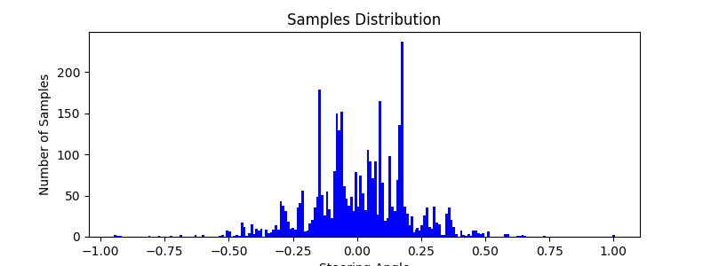
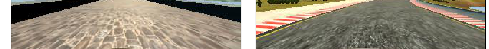
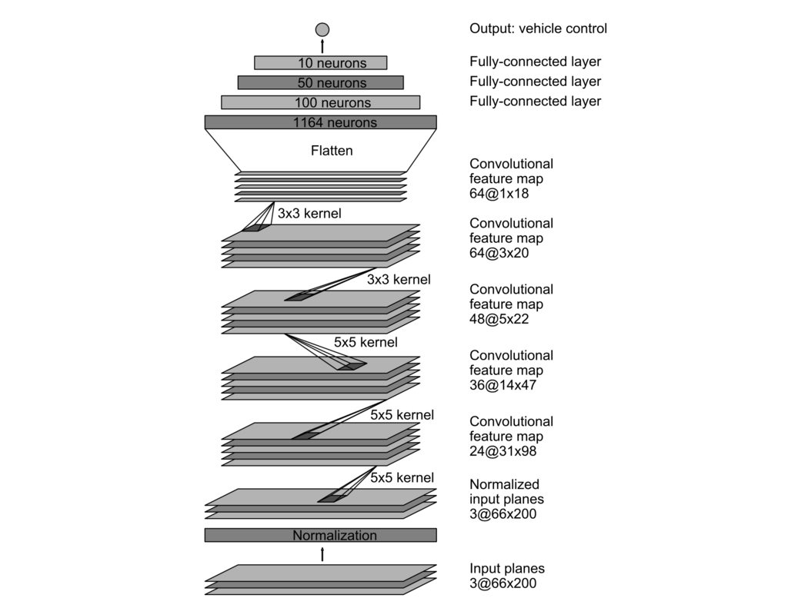

# Behaviour Cloning


| Note    | |
|:-----------|:-------------|
| **Source Code**  | https://github.com/aurangzaib/CarND-Behavioral-Cloning-P3  |
| **How to train**  | `cd implementation && python main.py`      |
| **How to test**  | `python drive.py model.h5`      |

The goals of the project are as follows:

-	Use the simulator to collect data of good driving behavior.

-	Build a convolution neural network (CNN) in Keras that predicts steering angles from images.

-	Train and validate the model with a training and validation set.

-	Test that the model successfully drives around the track without leaving the road.


---

### 1-	Data Collection & Augmentation:

The data is collected in different stages and are as follows:
-	Dataset provided by Udacity for Track 1.
-	Dataset for all the curves and turns in the track.
-	Dataset for all the curves and turns in the track by driving the car in the opposite direction.
-	Dataset for the straight roads in the track.

#### i- Histogram Visualization:

| Source Code Reference    |  |
|:-----------|:-------------|
| File  | `implementation/visualization.py`  |
| Method  | `Visualization.visualize_histogram`      |


```python
for folder in folders:
    csv_file = folder + '/driving_log.csv'
    with open(csv_file) as file:
        for line in csv.reader(file):
            steering = float(line[3])
            if steering != 0:
                samples.append(steering)
                samples.extend((steering, steering + corr, steering - corr))
                samples.extend((-steering, -(steering + corr), -(steering - corr)))

samples = np.array(samples)
samples = samples.reshape(-1, 1)
samples = StandardScaler().fit_transform(samples)

mu, sigma = np.mean(samples), np.std(samples)

unique_classes, n_samples = np.unique(samples,
                                      return_index=False,
                                      return_inverse=False,
                                      return_counts=True)

width = 0.01
fig = plt.figure(figsize=(8, 3))
ax = fig.add_subplot(111)
ax.set_title('Samples Distribution')
ax.set_xlabel('Steering Angle')
ax.set_ylabel('Number of Samples')

plt.bar(unique_classes, n_samples, width, color="blue")

fig.savefig('{}steering-distribution-augmented-all-cameras-flips-0-removed-normalized.png'.format(
    conf["buffer_folder"]))

```
Following histogram shows `steering` distribution in the Udacity dataset.


To better visualize, this is the histogram with the near 0 `steering` values removed i.e. car going straight without much `steering`.


This histogram shows the distribution of `steering` values after appending the data with datasets discussed above.



After including the data from all 3 cameras "mounted" on the car.


Following histogram shows the distribution after data augmentation as well as flipped images.


_Note that the mean and the standard deviation of the dataset is not centered around 0, something which we will deal with in our pipeline by normalizing the dataset._

#### ii- Data Visualization:

| Source Code Reference    |  |
|:-----------|:-------------|
| File  | `implementation/visualization.py`  |
| Method  | `Visualization.visualize_features`      |

```python

with open("{}driving_log.csv".format(folder)) as file:
    samples = []
    # store all samples
    for line in csv.reader(file):
        samples.append(line)

    # shuffle samples and take only 10 of them randomly
    samples = (shuffle(samples))

    center, left, right = [], [], []
    str_center, str_left, str_right = [], [], []

    for sample in samples:
        steering = float(sample[3])
        if steering < -.1:
            left.append(sample[0])
            str_left.append(steering)
        elif steering > .1:
            right.append(sample[0])
            str_right.append(steering)
        else:
            center.append(sample[0])
            str_center.append(steering)

    center, left, right = center[:10], left[:10], right[:10]

    count = 0
    for m, s in zip(center, str_center):
        im = imr(folder + m)
        imf = np.fliplr(im)

        fig = plt.figure(figsize=(8, 5))
        ax = fig.add_subplot(111)
        plt.xticks([]), plt.yticks([])

        ax.set_title('Steering: {:.3f}'.format(s)), plt.imshow(im)
        fig.savefig("{}center-{}.png".format(conf["buffer_folder"] + "track2/", count))

        ax.set_title('Steering: {:.3f}'.format(-s)), plt.imshow(imf)
        fig.savefig("{}center-flip-{}.png".format(conf["buffer_folder"] + "track2/", count))
        count += 1

```

Here, a few of the training images along with their flips are shown. As we can see, there is a lot of information in the frame which may not contribute in inferring the steering values and also potentially making the classifier training process slow.


#### iii- Normalization and Cropping:

| Source Code Reference    |  |
|:-----------|:-------------|
| File  | `implementation/visualization.py`  |
| Method  | `Visualization.visualize_roi`      |
| File  | `implementation/classifier.py`  |
| Method  | `classifier.implement_classifier`      |

```python

top, bottom = 230, 135
left, right = 70, 70
track = "track1"
img = cv.imread("{}{}/right-flip-4.png".format(conf["buffer_folder"], track))
height, width = img.shape[0], img.shape[1]
res = img[int(top):int(top + bottom), int(left):int(width - right)]

```

As can be seen from the histograms, the dataset is not normalized i.e the mean is not around 0 and standard deviation is not around 1.

The data distribution before and after the normalization is as follows:


| Before Normalization    |  | After Normalization| |
|:-----------|:-------------|:-----------|:-------------|
| Mean  |  8.184-06 |	Mean  |  1.653e-18 |	
| Standard Deviation  |   0.229   | Standard Deviation  |   0.999   |


Each image contains the parts are not really very useful for training the classifier and can be removed to speed up the training processing. 

For example, the sky, hills and trees in the consecutive frames remain same and is something which do not contribute in inferring the steering values from the images.

We can remove these features from the images by defining the Region of Interest `ROI`. 

Normalization and cropping steps are part of the `Keras` model by adding a cropping layer. The advantage being part of the model is that it can parallelized on the GPU.




### 2- Neural Network and Training Strategy:

#### i- Model Architecture

| Source Code Reference    |  |
|:-----------|:-------------|
| File  | `implementation/classifier.py`  |
| Method  | `Classifier.implement_classifier`      |
| Model  | __NVIDEA__ SDC CNN Architecture      |
| Reference  | Architecture: https://arxiv.org/pdf/1604.07316.pdf      |
|   | Dropout: https://www.cs.toronto.edu/~hinton/absps/JMLRdropout.pdf      |

The architecture is a modified form of the model used by NVIDEA and described in a paper __End to End Learning for Self-Driving Cars__:
-	5 Convolution layers with respective Filters and Kernels.
-	3 Fully Connected (Dense) layers followed by Dropouts.
-	1 Output layer.




```python

model = Sequential()
shape = conf["shape"]
# normalize
model.add(Lambda(lambda x: (x / 255.0) - 0.5, input_shape=shape))
# cropping to reduce sky and other unnecessary features
model.add(Cropping2D(cropping=(conf["roi"])))
# layer 1
model.add(Conv2D(filters=24, kernel_size=conf["kernel5"],
                 strides=conf["strides"], activation=conf["activation"]))
# layer 2
model.add(Conv2D(filters=36, kernel_size=conf["kernel5"],
                 strides=conf["strides"], activation=conf["activation"]))
# layer 3
model.add(Conv2D(filters=48, kernel_size=conf["kernel5"],
                 strides=conf["strides"], activation=conf["activation"]))
# layer 4
model.add(Conv2D(filters=64, kernel_size=conf["kernel3"],
                 activation=conf["activation"]))
# layer 5
model.add(Conv2D(filters=64, kernel_size=conf["kernel3"],
                 activation=conf["activation"]))
model.add(Flatten())
# layer 6
model.add(Dense(units=100))
model.add(Dropout(rate=conf["rate"]))
# layer 7
model.add(Dense(units=50))
model.add(Dropout(rate=conf["rate"]))
# layer 8
model.add(Dense(units=10))
model.add(Dropout(rate=conf["rate"]))
# layer 9
model.add(Dense(units=1))
# update weights with adam optimizer and mse for error
model.compile(optimizer=conf["optimizer"], loss=conf["loss"])

```

| Network    |Filter  |  Kernel | Dropout  |  Output Dimension | Parameters |
|:-----------|:-------------|:-------------|:-------------|:-------------|:-------------|
| Normalization  |   |  |  |  |  0 | 
| Cropping  | 24|   |98.7  |160,320,3  |0  |
| Conv1  | 24  |5,5  |1.0  |65,320,3  |1824  |
| Conv2  | 36  |5,5  |1.0  |31,158,24  |21636  |
| Conv3  | 48  |5,5  |1.0  |14,77,36  |43248  |
| Conv4  | 64  |3,3  |1.0  |5,37,48  |27712  |
| Conv5  | 64 |3,3  |1.0  |1,33,64  |36928  |
| Flatten  |   |  |  |2112  | 0 |
| Dense1  |   |  |0.5  |100  |211300  |
| Dense2  |   |  |0.5  |50  |5050  |
| Dense2  |   |  |0.5  |10  | 510 |
| Output  |   |  |  |1  | 11 |


#### ii- Training Strategy:

| Source Code Reference    |  |
|:-----------|:-------------|
| File  | `implementation/helper.py`  |
| Method  | `Helper.generator`      |
| Method  | `Helper.get_model`       |
| Method  | `Helper.save_model`       |
| Method  | `Helper.get_model_summary`       |

##### Generator:

-	The dataset is very large where each image's dimension is `160x320x3`. Also, in preprocessing the data type is changed from `int` to `float` making the size of dataset even larger.

-	Using generator we can pull pieces of data on the fly only when we need them. Size of the data is specified by `batch size`.

```python

for batch_sample in batch_samples:

    # center, left & right paths and steering
    center, left, right, steer, corr = Helper.get_paths_and_steering(batch_sample)

    # check for image file existence for given path in csv
    if exists(imdir + center) and exists(imdir + left) and exists(imdir + right):

        # center, left and right images
        im_center, im_left, im_right = imr(imdir + center), imr(imdir + left), imr(imdir + right)
        # steering for center, left and right images
        m_center, m_left, m_right = steer, steer + corr, steer - corr

        # extend images
        if conf["allow_data_flips"] is True:
            # flips of the images
            im_center_f, im_left_f, im_right_f = flp(im_center), flp(im_left), flp(im_right)

            # steering for flips
            m_center_f, m_left_f, m_right_f = -steer, -(steer + corr), -(steer - corr)

            # extend measurements and images with flips
            images.extend((im_center_f, im_left_f, im_right_f))
            measurements.extend((m_center_f, m_left_f, m_right_f))

        # extend measurements and images with originals
        images.extend((im_center, im_left, im_right))
        measurements.extend((m_center, m_left, m_right))

features = np.array(images)
labels = np.array(measurements)

```

##### Transfer Learning

Trasnfer learning technique can be used to train and test classifier on a selected dataset at a time and used the optimzed weights the next time on a new dataset.  The technique helped in spoting and fixing the problems in the training process very efficiently.

The steps are as follows:

-	Train on a dataset and save the model.
-	Test the model and see which areas of the track the car has problem navigating on.
-	Collect data of that region of the road and train the classifier again by using the weights, optimizer and loss from the previously trained network.


```python

model = load_model('../model.h5') if conf["use_pre_trained"] else Classifier.implement_classifier()

```

##### Dropouts:

Dropout is used after each Fully Connected (Dense) layer. 

Dropout was proposed by Geoffrey Hinton et al. It is a technique to reduce overfit by randomly dropping the few units so that the network can never rely on any given activation. Dropout helps network to learn redundant representation of everything to make sure some of the information retain.


| Dropout Parameter    |  |
|:-----------|:-------------|
| Keep Probability  | 0.5  |

```python

model.add(Dropout(rate=conf["rate"]))

```

##### Backpropogation:

Adam Optimizer is used to update the weights. Mean Square Error (MSE) is used to keep track of the errors.
    
```python

model.compile(optimizer=conf["optimizer"], loss=conf["loss"])

```

### 3- Testing the network:

| Source Code Reference    |  |
|:-----------|:-------------|
| File  | `implementation/video.py`  |
| Method  | `main`      |

After training the network, it is tested on the track by allowing the car autonomously and validating that the car doesn't drop off the road.

Udacity provided a simulator which acts as a server which provides stream of the `image frames` as features and the network predicts the `steering` values as labels.

The inferred `steering` values are used to navigate the car on the track.

Here is the video of the car driving autonomously on the track 1:

[](http://www.youtube.com/watch?v=eA-kU__V18w)


Here is the video of the car driving autonomously on the track 1 in opposite direction:


[](http://www.youtube.com/watch?v=8rpVWpT8omc)
