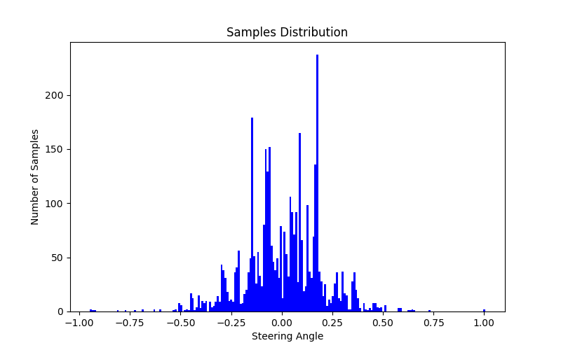
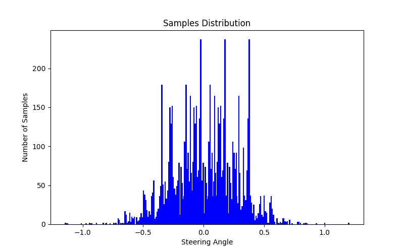
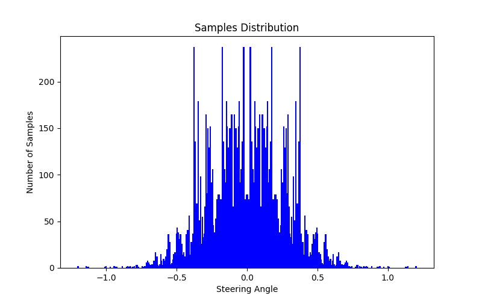
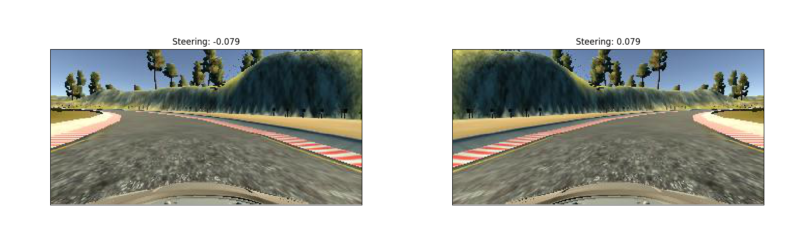
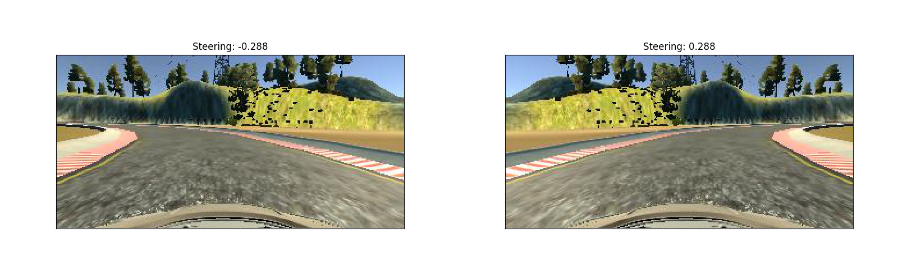
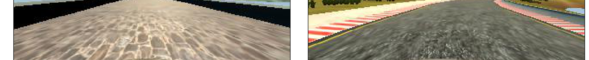
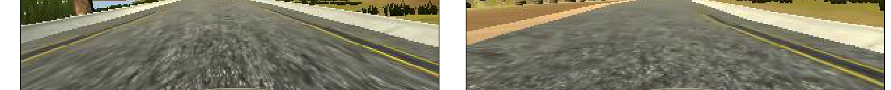

# Behaviour Cloning

| Note    | |
|:-----------|:-------------|
| **Source Code**  | https://github.com/aurangzaib/CarND-Behavioral-Cloning-P3  |
| **How to run**  | `cd implementation && python main.py`      |

The steps of the project are as follows:

-	Use the simulator to collect data of good driving behavior.

-	Build a convolution neural network (CNN) in Keras that predicts steering angles from images.

-	Train and validate the model with a training and validation set.

-	Test that the model successfully drives around the track without leaving the road.

---

### 1-	Data Collection & Augmentation:

#### i- Histogram Visualization:

#### ii- Data Visualization:

#### Cropping:

### 2- Neural Network and Training Strategy:

#### i- Model Architecture

-	NVIDEA DNN architecture.
-	5 Convolution layers.
-	3 Fully Connected (Dense) layers.
-	1 Output layer.
- 	Normalization:
	-	To center the mean and standard deviation around 0.
-	Cropping:
	- To remove the areas of the image which are not useful for training the classifier e.g. sky etc.
-	Dropouts:
	- Used with Dense layers with keep probability of 0.5 to reduce the overfit.
- Backpropogation:
	- Adam Optimizer is used to update the weights and Mean Square Error (MSE) is used to keep track of the errors.

| Pipeline    |Filter  |  Kernel | Dropout  |  Output Dimension | Parameters |
|:-----------|:-------------|:-------------|:-------------|:-------------|:-------------|
| Normalization  |   |  |  |  |  0 | 
| Cropping  | 24|   |98.7  |160,320,3  |0  |
| Conv1  | 24  |5,5  |1.0  |65,320,3  |1824  |
| Conv2  | 36  |5,5  |1.0  |31,158,24  |21636  |
| Conv3  | 48  |5,5  |1.0  |14,77,36  |43248  |
| Conv4  | 64  |3,3  |1.0  |5,37,48  |27712  |
| Conv5  | 64 |3,3  |1.0  |1,33,64  |36928  |
| Flatten  |   |  |  |2112  | 0 |
| Dense1  |   |  |0.5  |100  |211300  |
| Dense2  |   |  |0.5  |50  |5050  |
| Dense2  |   |  |0.5  |10  | 510 |
| Output  |   |  |  |1  | 11 |