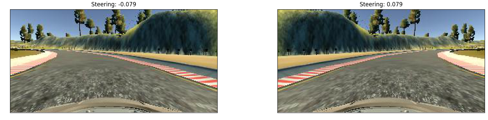
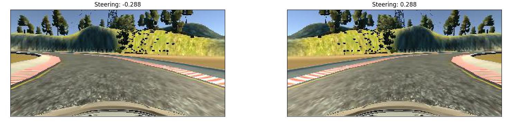

# Behaviour Cloning

| Note    | |
|:-----------|:-------------|
| **Source Code**  | https://github.com/aurangzaib/CarND-Behavioral-Cloning-P3  |
| **How to train**  | `cd implementation && python main.py`      |
| **How to test**  | `python drive.py model.h5`      |

The steps of the project are as follows:

-	Use the simulator to collect data of good driving behavior.

-	Build a convolution neural network (CNN) in Keras that predicts steering angles from images.

-	Train and validate the model with a training and validation set.

-	Test that the model successfully drives around the track without leaving the road.

---

### 1-	Data Collection & Augmentation:

The data is collected in different stages and are as follows:
-	Dataset provided by Udacity for Track 1.
-	Dataset for all the curves and turns in the track.
-	Dataset for all the curves and turns in the track by driving the car in the opposite direction.
-	Dataset for the straight roads in the track.

#### i- Histogram Visualization:

| Source Code Reference    |  |
|:-----------|:-------------|
| File  | `implementation/visualization.py`  |
| Method  | `Visualization.visualize_histogram`      |

Following histogram shows `steering` distribution in the Udacity dataset.

To better visualize, this is the histogram with the near 0 `steering` values removed i.e. car going straight without much `steering`.

This histogram shows the distribution of `steering` values after appending the data with datasets discussed above.

After including the data from all 3 cameras "mounted" on the car.

Following histogram shows the distribution after data augmentation as well as flipped images.

_Note that the mean and the standard deviation of the dataset is not centered around 0, something which we will deal with in our pipeline by normalizing the dataset._

#### ii- Data Visualization:

| Source Code Reference    |  |
|:-----------|:-------------|
| File  | `implementation/visualization.py`  |
| Method  | `Visualization.visualize_features`      |

Here, a few of the training images along with their flips are shown. As we can see, there is a lot of information in the frame which may not contribute in inferring the steering values and also potentially making the classifier training process slow.

#### iii- Normalization and Cropping:

| Source Code Reference    |  |
|:-----------|:-------------|
| File  | `implementation/visualization.py`  |
| Method  | `Visualization.visualize_roi`      |
| File  | `implementation/classifier.py`  |
| Method  | `classifier.implement_classifier`      |

As can be seen from the histograms, the dataset is not normalized i.e the mean is not around 0 and standard deviation is not around 1.

The data distribution before and after the normalization is as follows:

| Before Normalization    |  | After Normalization| |
|:-----------|:-------------|:-----------|:-------------|
| Mean  |  8.184-06 |	Mean  |  1.653e-18 |	
| Standard Deviation  |   0.229   | Standard Deviation  |   0.999   |

Each image contains the parts are not really very useful for training the classifier and can be removed to speed up the training processing. 

For example, the sky, hills and trees in the consecutive frames remain same and is something which do not contribute in inferring the steering values from the images.

We can remove these features from the images by defining the Region of Interest `ROI`. 

Normalization and cropping steps are part of the `Keras` model by adding a cropping layer. The advantage being part of the model is that it can parallelized on the GPU.

### 2- Neural Network and Training Strategy:

#### i- Model Architecture

| Source Code Reference    |  |
|:-----------|:-------------|
| File  | `implementation/classifier.py`  |
| Method  | `Classifier.implement_classifier`      |

-	NVIDEA DNN architecture.
-	5 Convolution layers.
-	3 Fully Connected (Dense) layers.
-	1 Output layer.
- 	Normalization:
	-	To center the mean and standard deviation around 0.
-	Cropping:
	- To remove the areas of the image which are not useful for training the classifier e.g. sky etc.
-	Dropouts:
	- Used with Dense layers with keep probability of 0.5 to reduce the overfit.
- Backpropogation:
	- Adam Optimizer is used to update the weights and Mean Square Error (MSE) is used to keep track of the errors.

| Pipeline    |Filter  |  Kernel | Dropout  |  Output Dimension | Parameters |
|:-----------|:-------------|:-------------|:-------------|:-------------|:-------------|
| Normalization  |   |  |  |  |  0 | 
| Cropping  | 24|   |98.7  |160,320,3  |0  |
| Conv1  | 24  |5,5  |1.0  |65,320,3  |1824  |
| Conv2  | 36  |5,5  |1.0  |31,158,24  |21636  |
| Conv3  | 48  |5,5  |1.0  |14,77,36  |43248  |
| Conv4  | 64  |3,3  |1.0  |5,37,48  |27712  |
| Conv5  | 64 |3,3  |1.0  |1,33,64  |36928  |
| Flatten  |   |  |  |2112  | 0 |
| Dense1  |   |  |0.5  |100  |211300  |
| Dense2  |   |  |0.5  |50  |5050  |
| Dense2  |   |  |0.5  |10  | 510 |
| Output  |   |  |  |1  | 11 |